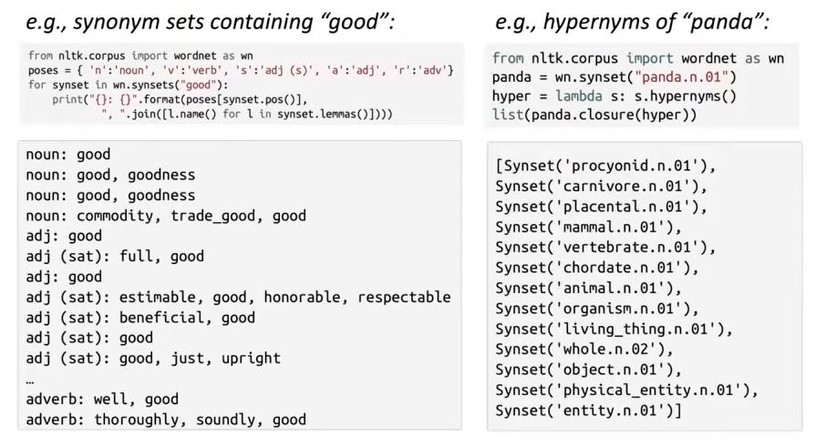
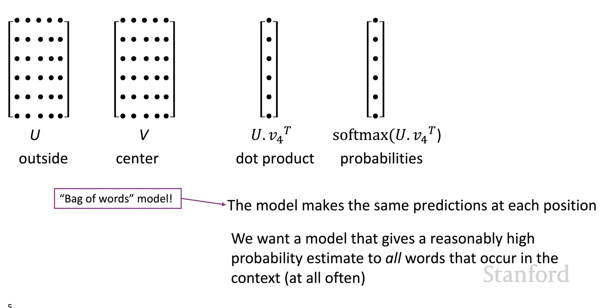
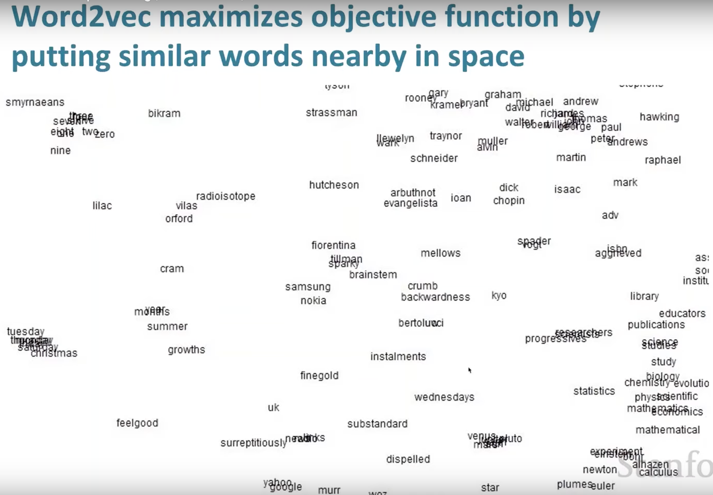

# Word Vectors

**WordNet** - Thesaurus containing lists of Synonym sets and hypernyms(”is a” relationships)

### Issue with Traditional NLP:

1. Words are regarded as discrete symbols(localist representation). So, if vocab size is 500,000. Word hotel is represented by a 500,000 one-hot vector.
2. No Word Relationship or similarity. Two one-hot vector is just orthogonal

### Representing Words by their context in DL:

Words Meaning is given by the words that frequently appear close-by

Word Vectors/Work embedding → word represented by vectors in high dimensional vector space(like 300). Cant visualize but can project into 2d but lose lot of information.

## Word2Vec

Framework for learning word vectors.

1. Large corpus of text
2. Create a fixed vocab from the large corpus(some preprocess steps)
3. Represent Each work in the Fixed Vocab by a vector
4. Iterate through each word at position ‘t’ in the text, which will be the center word ‘c’ and context words are words outside ‘o’. Use similarity of c and o to calculate prob of o given c and once we see the context word ‘o’ keep adjusting the word vectors to maximize the prob.

### Word2vec: Objective Function

For each position t=1m…,T, predict context words within a window of fixed size m, geven center word $w_j$. The likelihood function is given by:

$$L(\theta) = \prod_{t=1}^T \prod_{j \neq 0, -m \leq j \leq m} P(w_{t+j} | w_t; \theta)$$
where θ represents all the variables to be optimized.

The objective function J(θ) is the (average) negative log-likelihood:

$$J(\theta) = -\frac{1}{T} \log L(\theta) = -\frac{1}{T} \sum_{t=1}^T \sum_{j \neq 0, -m \leq j \leq m} \log P(w_{t+j} | w_t; \theta)$$

The objective function is sometimes called a cost or loss function.
$\text{Minimizing objective function} \Leftrightarrow \text{Maximizing predictive accuracy}$

minimize objective function $J(\theta)$

$$J(\theta)=\frac{-1}{T} \sum_{t=1}^T \sum_{\substack{j \leq j \leq m \\ j \neq 0}} \log P\left(\omega_{t+j} \mid \omega_t ; \theta\right)$$

To calculate $P\left(w_{t+j} \mid w_t ; \theta\right)$, we use two vectors per word "w":

$v_w$ when w is a center word

$u_w$ when w is a context word.

Then for context ward "o", and center word "c"

$$P(o\mid c)=\frac{\exp \left(u_0^{\top} v_c\right)}{\sum_{w \in v} \exp \left(u^{\top}_w v_c\right)}$$
lager dot product = larger Probability

Dot product between o and c vectors, compares similarity

$$\theta=\left[\begin{array}{c}
\text { Vaardvert } \\
\vdots \\
\text { veewer } \\
\text { Ueaduak } \\
\vdots \\
\text { Uzebra }
\end{array}\right] \in R^{2 d v}$$

Compute Gradient w.rt $v_c$ and $u_o$

$$\begin{aligned}
& \frac{\partial}{\partial v_c} p(0 \mid c)=u_0-\sum_{x=1}^n \frac{\exp \left(u_x^T v_c\right)}{\sum_1^n \exp \left(u_w^T v_c\right)} u_w \\
& =u_0-\sum_{x=1}^n p(n \mid c) u_y=u_0-E\left[u_0\right] \\
& \text { observed - expected } \\
&
\end{aligned}$$

Word2vec maximizes objective function by putting similar words nearby in space

So for a window ‘m’ in SGD, we only have at most 2m+1 words, making our gradient vector very sparse(so not efficient).

$$\nabla_{\theta} J_t(\theta)=\left[\begin{array}{c}
\text { 0 } \\
\vdots \\
\nabla_{v_{like}} \\
\vdots \\
\text { 0 } \\
\nabla_{u_{I}}  \\
\vdots \\
\nabla_{u_{learning}} \\
\vdots \\
\text { 0 } \\
\end{array}\right] \in R^{2 d v}$$

Words Vectors are row vector in DL frameworks.

# Word2Vec part2

Why two vectors(context and center?

→ Easier optimization, just avg both at the end. But if single vector than, we would have $x^Tx$ giving quadratic term than can make calculus for optimization and gradients messy.

## Variants of Word2Vec:

### Skip-Grams(SG):

Predict context word(independent position) given center word. Covered in last lec

### Continuous Bag of Words(CBOW):

 Predict center from bag of context words

We used naive softmax, which is simple but expensive for training. Negative sampling improves efficiency. SG → SGNS(HW2)

Motivation for Negative Sampling:

$P(o\mid c)=\frac{\exp \left(u_0^{\top} v_c\right)}{\sum_{w \in V} \exp \left(u^{\top}_w v_c\right)}$

${\sum_{w \in v} \exp \left(u^{\top}_w v_c\right)}$ → To compute this, we need to calculate dot product with center work for each of the maybe 100,000 words in the Vocabulary

Solution idea → train binary logistic regressions for a true pair (center word and a word in its context window) versus several noise pairs (the center word paired with a random words)

SGNP

[arxiv.org](https://arxiv.org/pdf/1310.4546)

Distributed presentation of words and phrases, Mikolov et al. 2013

$J(\theta) = \frac{1}{T} \sum_{t=1}^k  J_t(\theta)$  # loss for each center word in particular window

$J_t(\theta)=\log \sigma\left(u_o^T v_c\right)+\sum_{i=1}^k \mathbb{E}_{j \sim P(w)}\left[\log \sigma\left(-u_j^T v_c\right)\right]$

where, $\sigma(x) = \frac{1}{1+e^{-x}}$

Maximize $J_t(\theta)$   by making the dot product between the center and outside word large. First art of of $J_t(\theta)$ is actual context word and second part is random word thus the negative sign so that its maximized in both case.

Rewriting to match Hw2 and class:

$J_{neg-sample}(u_o, v_c, U) =-\log \sigma\left(u_o^T v_c\right) - \sum_{k \in \text{\{K sampled index}\}} \log(-u_k^Tv_c)$

- We take k negative samples (using word probabilities)
- Maximize probability that real outside word appears, minimize probability that random words appear around center word

**Trick**:
Sample with P(w)=U(w)3/4/Z,

the unigram distribution U(w) raised to the 3/4 power (We provide this function in the starter code).The power makes less frequent words be sampled more often(meaning dampening diff between common and real word, less frequent word occurs more often but not that much also unlike uniform)
Unigram is just frac if “hello” occurs 90 times in vocab of 1,000 then pob → 90/1000

### Co-Occurrence Matrix

1. Window → like word2vec. In window for center word count the context changing position t for center word
2. Full Document → Latent Semantic analysis

### Example of Window-Based Co-occurrence matrix:

Issues with such representation:

high dimensional, large size vectors. Its sparsity will make model less robust in downstream tasks.

Solution → Reduce Dimension to like 25-1000 low dimensional dense vector using techiques like SVD/PCA.

Running SVD on Raw  counts doesnt work well. Some hacks used in Rohde et al. 2005 COALS

- Problem is function words(the, he, has) are too frequent → log frequencies, or cap, or ignore function words
- Use pearson corr instead of counts then set neg val to 0 ,
- ramped windows that count closer works more than further away words

## GloVe

Glove uses both like training NN based on co-occurrence matrix.

The picture shows how meaning components(like man: king :: woman: queen) can be encoded with ratios of co-occurrence prob.

How do we capture this?

→ using Log-bilinear model

$w_i \cdot w_j = logP(i|j)$

vector difference will be then $w_x \cdot (w_a - w_b) = log(\frac{P(x|a)}{P(x|b)}$

f → to cap the large count co-occurrence element

## How to Evaluate word vectors?

**Intrinsic**:

Directly evaluate on specific/intermediate sub task. Its faster to compute and helps understand the system. But it might not be clear about its effect on real task like Machine Translation or ..

Use vector analogies like a:b::c:?   → d = $argmax_i\frac{(x_b-x_b+x_c)^Tx_i}{||x_b-x_a+x_c}$

Evaluate by cosine distance after addition of intuitive semantic and syntactic analogy questions.(trick, discarding the input words from the search).

problem with such evaluation: What if the information is there but its not linear??

**Extrinsic**:

Evaluation on real task itself like web search or machine translation. Improve performance on these task and evaluate the word vector. But it might not be clear if word vectors is the issue or something wrong with the real task.

One Example where good word vector should help :

Named entity Recognition → Identifying references to a person, organization, or location

Note: Good dimension for word vector is ~300.

### Word Sense vector

’Bank’ word has lot of meaning. Can we represent word sense as vector instead of word vetor? yes done at huang et al by clustering word windows around words, retrain with each word assigned to multiple different clusters $bank_1, bank_2$,… etc

Problem : Unclear. In practice usually good with word vector.

In Practice we used word vector.

Different senses of a word reside in a linear superposition(weighted sum) in standard word embedding like word2vec

$v_{bank} = \alpha_1 v_{bank_1}+\alpha_2v_{bank_2} + ...$

where, $\alpha_1 = \frac{f_1}{f_1 + f_2 + f_3}$

In application $v_{bank}$ self disambiguate, if we ask if bank is similar to teller then yes as some of its component relates to it and also yes for river as some of its component relates to river.

Due to sparsity, we can get sense out of word using sparse coding:

